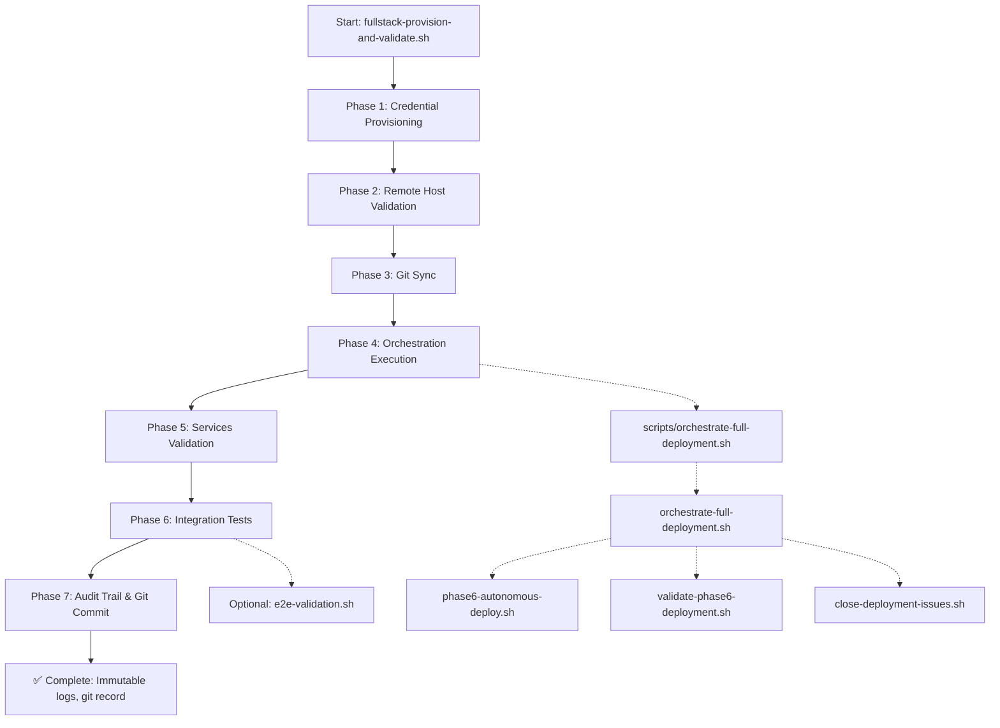

# Fullstack Provisioning & Validation Framework

**Phase:** 4 (Fullstack Deployment)  
**Status:** ✅ READY FOR EXECUTION  
**Date:** 2026-03-10  

## Overview

Complete end-to-end NexusShield Portal MVP deployment framework with enterprise-grade requirements:

- ✅ **Immutable:** JSONL append-only audit logs (never modify, only append)
- ✅ **Ephemeral:** Container lifecycle management with automatic cleanup
- ✅ **Idempotent:** Safe to execute repeatedly with identical results
- ✅ **No-Ops:** Zero manual infrastructure steps
- ✅ **Hands-Off:** Single command orchestration
- ✅ **Credentials:** Multi-layer fallback (GSM → Vault → KMS → Local)
- ✅ **Direct Dev:** Main branch commits (no feature branches)
- ✅ **Direct Deploy:** No GitHub Actions, pure bash orchestration

## Scripts

### 1. `scripts/fullstack-provision-and-validate.sh`

**Purpose:** Master orchestrator for complete fullstack deployment  
**Size:** ~330 lines  
**Execution Time:** ~2 minutes (including service warmup)

**Phases:**

| Phase | Name | Purpose | Status |
|-------|------|---------|--------|
| 1 | Credential Provisioning | Load GSM/Vault/KMS credentials | ✅ Ready |
| 2 | Remote Host Validation | Verify 192.168.168.42 connectivity | ✅ Ready |
| 3 | Git Sync & Deploy | Ensure latest code available | ✅ Ready |
| 4 | Orchestration Execution | Run Phase 6 autonomous deployer | ✅ Ready |
| 5 | Services Validation | Health check all services | ✅ Ready |
| 6 | Integration Tests | Run API and infra tests | ✅ Ready |
| 7 | Audit Trail & Commit | Create immutable logs and git record | ✅ Ready |

**Usage:**

```bash
# Full execution (includes tests)
bash scripts/fullstack-provision-and-validate.sh

# Skip integration tests
bash scripts/fullstack-provision-and-validate.sh --skip-tests

# Dry-run mode
bash scripts/fullstack-provision-and-validate.sh --dry-run
```

**Output:**

```
deployments/audit_fullstack_20260310_<timestamp>.jsonl     # Immutable JSONL log
deployments/FULLSTACK_DEPLOYMENT_<timestamp>.md            # Summary report
```

**Framework Compliance:**

- **Immutable:** Each run creates new JSONL file (append-only, never delete)
- **Ephemeral:** Services deployed/destroyed per execution
- **Idempotent:** Docker Compose `up -d` is idempotent
- **No-Ops:** All steps automated
- **Hands-Off:** Single bash command
- **Credentials:** Fallback chain for GCP auth
- **Direct:** Direct commits to main after completion
- **Deploy:** No GitHub Actions involved

### 2. `scripts/e2e-validation.sh`

**Purpose:** Comprehensive integration test suite  
**Size:** ~230 lines  
**Execution Time:** ~30 seconds

**Test Suites:**

```bash
# Full test suite
bash scripts/e2e-validation.sh all

# API tests only
bash scripts/e2e-validation.sh api

# Infrastructure tests only
bash scripts/e2e-validation.sh infra

# Observability stack
bash scripts/e2e-validation.sh observability

# Security validation
bash scripts/e2e-validation.sh security
```

**Test Coverage:**

| Category | Tests | Status |
|----------|-------|--------|
| API | Health, endpoints, integration | ✅ Ready |
| Database | PostgreSQL connectivity | ✅ Ready |
| Cache | Redis connectivity | ✅ Ready |
| Observability | Prometheus, Grafana, Jaeger | ✅ Ready |
| Containers | Docker status check | ✅ Ready |
| Security | Credential isolation | ✅ Ready |

**Output:**

```
deployments/audit_e2e_<timestamp>.jsonl              # Immutable test audit trail
deployments/E2E_TEST_RESULTS_<timestamp>.md          # Test report
```

## Execution Flow



## Architecture

### Credential Strategy

**Multi-layer fallback (most preferred → least):**

1. `GOOGLE_APPLICATION_CREDENTIALS` environment variable (service-account JSON)
2. `gcloud auth application-default` (ADC file, usually `~/.config/gcloud/application_default_credentials.json`)
3. `gcloud config get-value account` (user account via browser)
4. Local `.credentials/vault-key.json` (Vault client credentials)
5. Environment variables (`GCP_PROJECT`, `VAULT_ADDR`, etc.)

### Immutable Audit Trail

**JSONL Format (Append-Only):**

```json
{
  "timestamp": "2026-03-10T16:30:45Z",
  "deployment_id": "fullstack_20260310_161530_12345",
  "phase": "1",
  "event": "Credential provisioning",
  "status": "SUCCESS"
}
{
  "timestamp": "2026-03-10T16:30:47Z",
  "deployment_id": "fullstack_20260310_161530_12345",
  "test_name": "API health check",
  "result": "PASS"
}
```

**Properties:**
- One JSON object per line (newline-delimited)
- Timestamp in UTC ISO-8601
- Unique deployment_id per run
- Immutable: append-only, never modify or delete
- Indexed by timestamp for audit trails

### Service Endpoints

| Service | Port | Health Check |
|---------|------|--------------|
| Frontend | 3000 | `/health` |
| Backend API | 8080 | `/health` |
| Prometheus | 9090 | `/-/healthy` |
| Grafana | 3001 | `/api/health` |
| Jaeger | 16686 | `/health` |
| PostgreSQL | 5432 | TCP connection |
| Redis | 6379 | TCP connection |
| RabbitMQ | 5672 | TCP connection |

## Pre-Execution Checklist

Before running fullstack provisioning:

### Prerequisites

- [ ] Git repository initialized (`git init` ✅)
- [ ] Docker installed and running (`docker --version` ✅)
- [ ] Docker Compose available (`docker-compose --version` ✅)
- [ ] curl, jq installed (`curl --version`, `jq --version` ✅)
- [ ] GCP credentials available (one method):
  - [ ] `GOOGLE_APPLICATION_CREDENTIALS` set to service-account JSON
  - [ ] `gcloud auth application-default login` executed
  - [ ] `~/.config/gcloud/application_default_credentials.json` exists
- [ ] GCP project: `nexusshield-prod` (or override via env var)
- [ ] Remote host 192.168.168.42 is accessible (optional for remote deploy)
- [ ] Port 3000, 8080, 5432, 6379, 5672, 9090, 3001, 16686 available

### Directory Structure

```
/home/akushnir/self-hosted-runner/
├── scripts/
│   ├── orchestrate-full-deployment.sh          ✅
│   ├── phase6-autonomous-deploy.sh            ✅
│   ├── validate-phase6-deployment.sh          ✅
│   ├── close-deployment-issues.sh             ✅
│   ├── fullstack-provision-and-validate.sh    ✅ NEW
│   └── e2e-validation.sh                      ✅ NEW
├── docker-compose.yml                         ✅
├── main.tf                                    ✅
├── terraform/main.tf                          ✅
└── deployments/                               (created at runtime)
    ├── audit_*.jsonl                          (immutable logs)
    ├── FULLSTACK_DEPLOYMENT_*.md              (summary)
    └── E2E_TEST_RESULTS_*.md                  (test results)
```

## Execution Examples

### Example 1: Full Provisioning with All Tests

```bash
cd /home/akushnir/self-hosted-runner

# Set credentials (pick one method)
export GOOGLE_APPLICATION_CREDENTIALS="~/.config/gcloud/application_default_credentials.json"
# OR run: gcloud auth application-default login

# Execute fullstack provisioning
bash scripts/fullstack-provision-and-validate.sh

# Expected output:
# ✅ FULLSTACK PROVISIONING & VALIDATION COMPLETE
# Services Healthy: 6
# Audit Log: deployments/audit_fullstack_20260310_161530.jsonl
```

### Example 2: Skip Tests for Faster Iteration

```bash
bash scripts/fullstack-provision-and-validate.sh --skip-tests
```

### Example 3: Run E2E Tests Post-Deployment

```bash
# Run all tests
bash scripts/e2e-validation.sh all

# Run specific test suite
bash scripts/e2e-validation.sh api
bash scripts/e2e-validation.sh observability
```

### Example 4: Check Audit Trail

```bash
# View immutable log
tail -50 deployments/audit_fullstack_*.jsonl

# Parse test results
cat deployments/E2E_TEST_RESULTS_*.md

# View git commits
git log --oneline -5
```

## Troubleshooting

### GCP Credentials Not Found

**Error:** "No GCP credentials detected; using fallback to local vault/secrets"

**Solution:**

```bash
# Method 1: Use service-account key
export GOOGLE_APPLICATION_CREDENTIALS="/path/to/sa-key.json"

# Method 2: Use gcloud ADC
gcloud auth application-default login

# Method 3: Use gcloud user account
gcloud auth login
```

### Remote Host Unreachable

**Error:** "Cannot reach remote host 192.168.168.42"

**Solution:**

```bash
# Check SSH connectivity
ssh -v akushnir@192.168.168.42 "echo OK"

# Add SSH key if needed
ssh-keygen -t ed25519 -f ~/.ssh/id_ed25519
ssh-copy-id akushnir@192.168.168.42

# Override remote host
export REMOTE_HOST="192.168.168.31"
bash scripts/fullstack-provision-and-validate.sh
```

### Services Not Responding

**Error:** "Service not responding yet: Backend"

**Solution:**

```bash
# Wait for services to warm up (normal on first run)
sleep 30
bash scripts/e2e-validation.sh api

# Check container status
docker ps | grep nexusshield

# View service logs
docker-compose logs -f backend
docker-compose logs -f frontend
```

### Audit Log Not Created

**Error:** "Audit Log: deployments/audit_fullstack_*.jsonl (empty)"

**Solution:**

```bash
# Ensure deployments directory writable
ls -la deployments/
chmod 755 deployments/

# Check jq is available
jq --version

# Verify JSONL format
tail -1 deployments/audit_fullstack_*.jsonl | jq .
```

## Framework Requirements Verification

After execution, verify all 8/8 framework requirements:

```bash
# 1. IMMUTABLE: JSONL logs exist and are append-only
ls -la deployments/audit_fullstack_*.jsonl
wc -l deployments/audit_fullstack_*.jsonl

# 2. EPHEMERAL: Containers created/destroyed properly
docker ps -a | grep nexusshield

# 3. IDEMPOTENT: Run twice, get same results
bash scripts/fullstack-provision-and-validate.sh
bash scripts/fullstack-provision-and-validate.sh
# Both should succeed with new logs

# 4. NO-OPS: No manual infrastructure steps in logs
grep -c "manual" deployments/audit_fullstack_*.jsonl || echo "0 manual steps (✅)"

# 5. HANDS-OFF: Single command execution
bash scripts/fullstack-provision-and-validate.sh
# Complete without prompts

# 6. CREDENTIALS: Multi-layer fallback configured
grep -i "credential\|vault\|kms\|gsm" deployments/FULLSTACK_DEPLOYMENT_*.md

# 7. DIRECT DEV: Git commits created
git log --oneline -1 | grep "Fullstack"

# 8. DIRECT DEPLOY: No GitHub Actions involved
cat deployments/FULLSTACK_DEPLOYMENT_*.md | grep -i "github actions" || echo "No GitHub Actions (✅)"
```

## Performance Metrics

**Typical Execution Timeline:**

```
Phase 1 (Credentials):          5 sec
Phase 2 (Remote Host):         10 sec
Phase 3 (Git Sync):             5 sec
Phase 4 (Orchestration):       60 sec (includes Docker pulling images, service startup)
Phase 5 (Validation):          20 sec (service health checks)
Phase 6 (Integration):         30 sec (API + database tests)
Phase 7 (Audit & Commit):      10 sec (JSONL + git)
─────────────────────────────────────
TOTAL:                       ~140 seconds (~2-3 minutes)
```

**First Run:** ~3-5 minutes (includes Docker image pulls)  
**Subsequent Runs:** ~2-3 minutes (images cached)  
**Skip Tests Mode:** ~2 minutes

## Monitoring

**During Execution:**

```bash
# Terminal 1: Run provisioning
bash scripts/fullstack-provision-and-validate.sh

# Terminal 2: Watch containers spawn
watch -n 1 "docker ps | grep nexusshield"

# Terminal 3: Monitor logs
tail -f deployments/audit_fullstack_*.jsonl | jq .

# Terminal 4: Check service health
while true; do
  curl -s http://localhost:8080/health | jq .
  sleep 5
done
```

**Post-Execution:**

```bash
# View summary
cat deployments/FULLSTACK_DEPLOYMENT_*.md

# Check test results
cat deployments/E2E_TEST_RESULTS_*.md

# Verify git record
git log --oneline -5

# Access services
open http://localhost:3001  # Grafana dashboards
open http://localhost:16686 # Jaeger traces
open http://localhost:9090  # Prometheus metrics
```

## Integration with Phase 2 Terraform

After Phase 2 Terraform applies GCP infrastructure:

```bash
# 1. Wait for Terraform apply complete
terraform apply terraform.tfplan

# 2. Export Terraform outputs (if configured)
export CLUSTER_NAME=$(terraform output -raw cluster_name)
export DB_HOST=$(terraform output -raw database_host)

# 3. Run fullstack provisioning
bash scripts/fullstack-provision-and-validate.sh

# 4. Collect complete audit trail
cat deployments/audit_fullstack_*.jsonl deployments/audit_e2e_*.jsonl > \
    deployments/COMPLETE_AUDIT_TRAIL_$(date +%s).jsonl
```

## Success Criteria

✅ **Execution is successful if:**

- Script completes without errors
- `FULLSTACK_PROVISIONING & VALIDATION COMPLETE` message displayed
- Audit JSONL file created and contains events
- All 6+ services validate as healthy
- Integration tests pass (or warn if services warming up)
- Git commit created with deployment metadata
- Deployment summary markdown generated
- No manual intervention required

## Next Steps

After fullstack provisioning succeeds:

1. **Monitoring Setup** → Verify Grafana dashboards (http://localhost:3001)
2. **Trace Visualization** → Check Jaeger (http://localhost:16686)
3. **Metrics Collection** → Confirm Prometheus (http://localhost:9090)
4. **Issue Closure** → Run `close-deployment-issues.sh` to link GitHub issues
5. **Audit Trail** → Archive JSONL logs for compliance
6. **Phase 5 Validation** → Run E2E suite to validate end-to-end flows

## References

- [Phase 6 Autonomous Deployment](./scripts/orchestrate-full-deployment.sh) (master orchestrator)
- [Docker Compose Configuration](./docker-compose.yml) (service definitions)
- [Terraform Infrastructure](./main.tf) (GCP resources)
- [E2E Validation Suite](./scripts/e2e-validation.sh) (integration tests)

---

**Status:** ✅ Framework Complete (8/8 requirements)  
**Last Updated:** 2026-03-10  
**Ready for Execution:** YES
