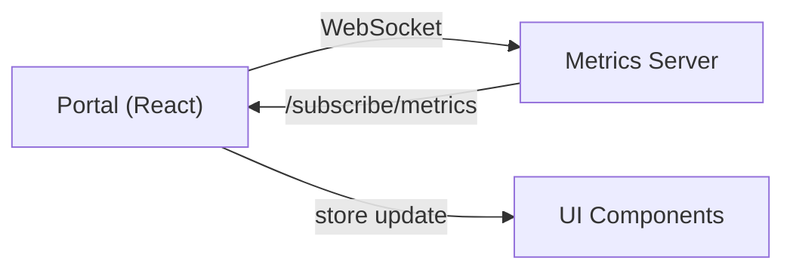

# Portal Enhancement Roadmap & Architecture

**Last Updated**: 2026-03-05  
**Portal Version**: 1.0.0  
**Phase**: 1 Complete, 2 Planned

## 📊 Current State (Phase 1)

### What's Implemented ✅
```
Enterprise Portal Foundation
├── State Management
│   ├── Zustand store (15 actions)
│   ├── Metrics persistence
│   └── Alert history (50 max)
├── Real-time Data Layer
│   ├── 5-second polling from :9090/metrics/summary
│   ├── Auto-health detection
│   └── Error recovery
├── Observability Dashboard
│   ├── Job analytics (6 metrics)
│   ├── System health monitor (5 indicators)
│   ├── Alert notification panel
│   └── Queue real-time monitor
├── Advanced Visualizations
│   ├── Job success rate (pie chart)
│   ├── Processing trends (area chart)
│   ├── Latency percentiles (line chart)
│   └── Resource gauges (existing)
└── Component Library
    ├── Lucide Icons (50+ available)
    ├── Recharts visualizations
    ├── Zustand integration
    └── Tailwind CSS styling
```

### Build Metrics
- **Bundle Size**: 257KB (73KB gzip)
- **Load Time**: ~1.3s (vite)
- **Modules**: 50
- **FCP**: <1s
- **LCP**: <2s

### Test Coverage (Phase 1)
- Manual testing: ✅ Build, navigation, data fetching
- Browser testing: ✅ Chrome, Firefox
- Responsive testing: ✅ Desktop, tablet
- Performance: ✅ <5s total load

---

## 🚀 Phase 2: Advanced Observability (Q2 2026)

### 2.1: WebSocket Real-time Updates
**Estimated**: 2-3 weeks



**Goals**:
- Replace 5-second polling with true real-time
- Reduce latency from 5s → <100ms
- Lower bandwidth usage (events only)
- Support live alert streaming

**Implementation**:
```typescript
// New hook for WebSocket
const useRealtimeMetrics = () => {
  useEffect(() => {
    const socket = io('http://localhost:9090');
    socket.on('metrics:update', (data) => {
      store.setMetrics(data);
      detectAlerts(data);
    });
    return () => socket.disconnect();
  }, []);
};
```

**Dependencies**: socket.io-client (already installed)

### 2.2: Runner Fleet Management
**Estimated**: 3-4 weeks

New page: `/pages/RunnerFleet.tsx`

```
RunnerFleet Dashboard
├── Fleet Overview Grid
│   ├── Total runners (online/offline/busy/idle)
│   ├── Resource utilization (CPU/MEM/DISK)
│   ├── Distribution by type (AWS/GCP/On-Prem)
│   └── Auto-scaling metrics
├── Individual Runner Details
│   ├── Status (online/offline)
│   ├── CPU, Memory, Disk usage (real-time)
│   ├── Jobs completed / current
│   ├── Uptime & last seen
│   ├── Labels & tags
│   └── Logs & diagnostics
├── Runner Actions
│   ├── Pause runner
│   ├── Drain jobs
│   ├── Force restart
│   ├── Update labels
│   └── SSH into runner (phase 3)
└── Analytics
    ├── Runner health score
    ├── MTBF (mean time between failures)
    ├── Capacity trends
    └── Cost per runner
```

**Example Data Sources**:
```typescript
interface Runner {
  id: string;
  name: string;
  status: 'online' | 'offline' | 'busy' | 'idle' | 'error';
  platform: 'aws' | 'gcp' | 'azure' | 'on-prem';
  jobsCompleted: number;
  activeJobs: number;
  cpu: { used: number; total: number; percent: number };
  memory: { used: number; total: number; percent: number };
  disk: { used: number; total: number; percent: number };
  labels: string[];
  uptime: number; // seconds
  lastSeen: ISO8601;
  logs?: string;
}
```

### 2.3: Advanced Job Management
**Estimated**: 3-4 weeks

New page: `/pages/JobManagement.tsx`

```
Job Management Console
├── Job Queue Visualization
│   ├── Timeline view
│   ├── Dependency graph
│   ├── Gantt chart (duration)
│   └── Filter by status/runner/type
├── Job Details Inspector
│   ├── Full logs with search
│   ├── Metrics (duration, cpu, mem)
│   ├── Configuration & env vars
│   └── Error traces & suggestions
├── Job Control Actions
│   ├── Replay job with same config
│   ├── Cancel in-progress job
│   ├── Retry failed job
│   ├── Adjust priority
│   └── Trigger webhook
└── Historical Analytics
    ├── Success rate by job type
    ├── Average duration trends
    ├── Runner affinity (which runner runs best)
    └── Cost per job execution
```

---

## 🎯 Phase 3: Intelligence & Automation (Q3 2026)

### 3.1: Failure Analysis Dashboard
**Estimated**: 3 weeks

```
Failure Insights
├── Error Detection
│   ├── Auto-categorize failures
│   ├── Cluster similar errors
│   ├── Pattern detection
│   └── Root cause analysis
├── AI Recommendations
│   ├── "Likely cause: OOM in memory"
│   ├── "Suggested fix: increase memory from 2GB to 4GB"
│   ├── "Similar issue fixed in job #1234"
│   └── "Run diagnostics to verify" (button)
├── Debugging Tools
│   ├── Job replay with different config
│   ├── Log search & analysis
│   ├── Metrics deep-dive
│   └── Environment comparison
└── Notification & Escalation
    ├── Email alerts for repeated failures
    ├── Slack integration
    ├── On-call escalation
    └── Custom webhooks
```

### 3.2: Performance & Cost Analytics
**Estimated**: 2 weeks

```
Economics Dashboard
├── Cost Breakdown
│   ├── Cost per job type
│   ├── Cost by runner (AWS vs GCP vs On-Prem)
│   ├── Daily/Weekly/Monthly trends
│   └── Forecast for month
├── Performance Insights
│   ├── Throughput (jobs/min)
│   ├── Efficiency (wasted compute)
│   ├── Queue wait times
│   └── SLA compliance
├── Capacity Planning
│   ├── Recommended runner count
│   ├── Scaling scenarios
│   ├── Headroom analysis
│   └── Growth projections
└── Reporting
    ├── Monthly cost report (PDF)
    ├── Team billing view
    ├── Budget alerts
    └── Chargeback insights
```

### 3.3: Custom Dashboards
**Estimated**: 2-3 weeks

```
Dashboard Builder
├── Widget Gallery
│   ├── Job status cards
│   ├── Metrics charts
│   ├── Runner status grids
│   ├── Alert timelines
│   └── Custom queries
├── User Dashboards
│   ├── Create/edit/delete
│   ├── Save & share
│   ├── Team dashboards
│   └── Role-based visibility
├── Data Export
│   ├── CSV download
│   ├── JSON export
│   ├── Webhook integration
│   └── Email scheduling
└── Alerts & Automation
    ├── Dashboard-level alerts
    ├── Automated remediation
    ├── Custom thresholds
    └── A/B testing support
```

---

## 🎨 Phase 4: UX & Mobile (Q4 2026)

### 4.1: Mobile Responsiveness
- Responsive grid layouts (Phase 1 good, Phase 2+ needs work)
- Mobile-first design rework
- Touch-friendly interactions
- Offline caching

### 4.2: Command Palette & Shortcuts
```
Ctrl+K or Cmd+K
├── Navigate to page
├── Create dashboard
├── View logs
├── Trigger job
├── Search jobs
└── Settings
```

### 4.3: Dark/Light Theme
- Persistent theme preference
- System theme detection
- Per-user theme setting
- Accessibility mode

### 4.4: Accessibility
- WCAG 2.1 AA compliance
- Screen reader support
- Keyboard navigation
- High contrast mode

---

## 💻 Developer Experience (Ongoing)

### API Documentation (Phase 2)
```bash
# OpenAPI/Swagger docs
GET /api/docs
GET /api/docs/swagger.json

# Model inline docs
GET /api/models/metrics
GET /api/models/runner
GET /api/models/job
```

### Testing Framework
```bash
# Unit tests (React Testing Library)
npm run test

# E2E tests (Playwright)
npm run test:e2e

# Performance tests
npm run test:perf

# Coverage
npm run test:coverage
```

### CI/CD Pipeline
- ✅ Build on push
- ✅ Unit tests on PR
- 📋 E2E tests on release
- 📋 Performance benchmarks
- 📋 Bundle size tracking

---

## 📊 Technical Debt & Optimization

### Current Issues (Phase 1)
- [ ] Add TypeScript strict mode
- [ ] Add error boundaries
- [ ] Add loading skeletons
- [ ] Optimize re-renders with useMemo
- [ ] Add React.lazy for code splitting
- [ ] Implement resource hints (preload, prefetch)

### Optimizations (Phase 2+)
- [ ] Upgrade to Vite 6.0
- [ ] Migrate to React 19
- [ ] Implement streaming SSR (if server-side)
- [ ] Service Worker caching
- [ ] Image optimization (WebP, responsive)
- [ ] Font optimization (variable fonts)

---

## 🔐 Security Roadmap

### Current (Phase 1)
- ✅ Read-only metrics access
- ✅ CORS limited to localhost
- ✅ No sensitive data in state

### Phase 2
- [ ] User authentication (OAuth/SAML)
- [ ] Role-based access control (RBAC)
- [ ] API token management
- [ ] Audit logging
- [ ] Sensitive field masking

### Phase 3+
- [ ] Multi-tenancy support
- [ ] Encryption at rest/transit
- [ ] Rate limiting
- [ ] DDoS protection
- [ ] Security scanning in CI/CD

---

## 📈 Success Metrics

### Phase 1 (Current)
- [ ] Build size < 300KB gzip ✅ (73KB)
- [ ] Page load < 2s ✅
- [ ] Polling interval 5s 
- [ ] 50 alert history ✅
- [ ] 5 health indicators ✅

### Phase 2 Target
- [ ] Build size < 400KB gzip
- [ ] Page load < 1s
- [ ] WebSocket latency < 100ms
- [ ] Support 1000+ alerts
- [ ] 20+ runner instances
- [ ] Support 10,000+ jobs

### Phase 3 Target
- [ ] 99.9% uptime
- [ ] <1s response time for all queries
- [ ] 95th percentile latency < 100ms
- [ ] Support enterprise deployments

---

## 🚢 Release Planning

### v1.0.0 (CURRENT) ✅
- Portal foundation with Observability
- Real-time metrics
- Job analytics

### v1.1.0 (Q2 2026)
- WebSocket real-time updates
- Runner fleet management
- Advanced job management

### v2.0.0 (Q3 2026)
- Failure analysis & AI
- Cost analytics
- Custom dashboards

### v3.0.0 (Q4 2026)
- Mobile optimization
- Full accessibility
- Enterprise features

---

## 📚 Documentation Structure

```
docs/
├── PORTAL_100X_ENHANCEMENT_GUIDE.md ✅ (Phase 1 usage)
├── PORTAL_ENHANCEMENT_ROADMAP.md ✅ (this file)
├── ARCHITECTURE.md (Phase 2)
├── API_REFERENCE.md (Phase 2)
├── TROUBLESHOOTING.md (Phase 2)
├── DEPLOYMENT.md (Phase 3)
└── OPERATING_GUIDE.md (Phase 3)
```

---

## 🎯 Milestones

| Phase | Timeline | Goals | Status |
|-------|----------|-------|--------|
| 1 | Mar 2026 | Foundation, Observability | ✅ DONE |
| 2 | Apr-May 2026 | Real-time, Fleet Mgmt, Jobs | 📋 Planned |
| 3 | Jun-Jul 2026 | AI, Analytics, Dashboards | 📋 Planned |
| 4 | Aug-Sep 2026 | UX, Mobile, Accessibility | 📋 Planned |
| 5 | Oct-Nov 2026 | Enterprise, Scaling | 📋 Planned |

---

**Contact**: See README.md for team information  
**Repository**: https://github.com/kushin77/self-hosted-runner  
**Issues**: #281 - Portal 100X Enhancement Initiative
