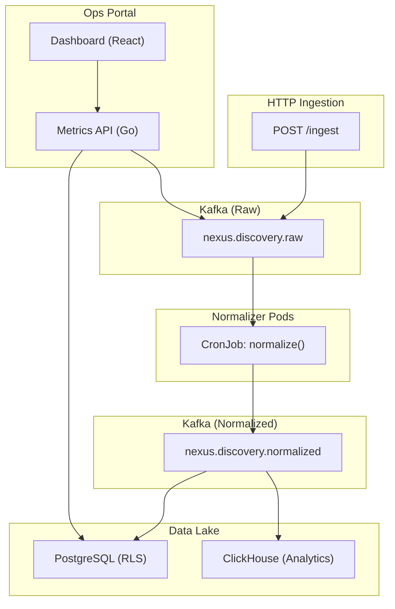

# NEXUS Ops Portal 
**Date:** March 12, 2026  
**Status:** Design & Scaffolding  
**Architecture Pattern:** Extracted from ElevatedIQ-Portal & NexusShield VS Code Extension

---

## Ops Portal Overview

A React/TypeScript web dashboard (+ VS Code extension variant) for real-time observability of the NEXUS discovery pipeline:
- Kafka queue depth & lag monitoring
- Normalizer job status & throughput
- Data freshness & error rates
- Audit log viewer
- Manual trigger controls
- Alert configuration (GSM/Vault-backed secrets)
- draw.io diagram rendering (inline architecture viewer)

---

## Technology Stack

| Layer | Technology | Notes |
|-------|-----------|-------|
| **Frontend** | React 18 + TypeScript | Vite bundler for fast HMR |
| **State Mgmt** | TanStack Query (React Query) | Real-time polling of Kafka metrics |
| **UI Components** | Material-UI v5 | Pre-built modular UI |
| **Charts/Metrics** | Recharts + Prometheus client | Real-time pipeline metrics |
| **Diagram Rendering** | mermaid.js or draw.io embed | Inline system architecture |
| **Auth** | OAuth 2.0 (Google/GitHub) | Via GSM-provisioned secrets |
| **Backend API** | Go (internal/api/portal.go) | Exposes Kafka metrics, audit logs |
| **Deployment** | Cloud Run (containerized) | Managed service, auto-scaling |

---

## Portal UI Panels (Extracted from NexusShield patterns)

### 1. **Dashboard** (Home)
- System health gauge (green/yellow/red)
- Kafka queue depth (real-time)
- Normalizer throughput (events/sec)
- Error rate trend (24h chart)
- Latest 5 pipeline failures (clickable for details)

### 2. **Kafka Metrics**
- `nexus.discovery.raw` → queue depth, consumer lag
- `nexus.discovery.normalized` → queue depth, producers
- Retention policy & cleanup
- Manual topic management (admin only)

### 3. **Normalizer Jobs**
- Active CronJob status (next run, last completion)
- Per-provider normalizer stats (GitHub, AWS, GCP, etc.)
- Error logs & retry attempts
- Manual trigger button (operator)
- Job runtime histogram

### 4. **Audit Log Viewer**
- JSONL immutable log stream from PostgreSQL
- Filters: timestamp, event type, provider, error status
- Export as CSV/JSON
- Real-time tail (Websocket)

### 5. **Credentials & Secrets** (Admin)
- List provisioned secrets in GSM/Vault
- View secret metadata (TTL, rotation date)
- Manual rotation trigger (requires approval)
- Audit trail of secret access (who, when, what)

### 6. **Architecture Diagram**
- Embedded draw.io or mermaid diagram
- Click nodes to navigate to relevant logs/metrics
- Zoom/pan controls
- Legend showing component health

### 7. **Alerts & Notifications**
- Slack webhook configuration (store in GSM)
- PagerDuty integration
- Alert threshold tuning (lag > 5 min, error rate > 1%, etc.)
- Activity stream (recent events)

---

## Backend API Contract (Go)

**Base URL**: `http://nexus-ingestion:8080` (or deployed service URL)

```go
// Portal service (internal/api/portal.go)

// GET /api/health
type HealthResponse struct {
  Status    string    `json:"status"`    // "healthy", "degraded", "unhealthy"
  Uptime    int64     `json:"uptime_sec"`
  Timestamp time.Time `json:"timestamp"`
}

// GET /api/kafka/metrics
type KafkaMetrics struct {
  RawTopic struct {
    QueueDepth int64 `json:"queue_depth"`
    ConsumerLag int64 `json:"consumer_lag"`
  } `json:"raw_topic"`
  NormalizedTopic struct {
    QueueDepth int64 `json:"queue_depth"`
    ProducerRate float64 `json:"producer_rate_eps"`
  } `json:"normalized_topic"`
}

// GET /api/normalizer/jobs
type NormalizerJobsResponse struct {
  Jobs []struct {
    Provider string `json:"provider"` // "github", "aws", "gcp"
    Status   string `json:"status"`   // "running", "completed", "failed"
    LastRun  time.Time `json:"last_run"`
    NextRun  time.Time `json:"next_run"`
    EventsProcessed int64 `json:"events_processed"`
    ErrorCount int64 `json:"error_count"`
    RuntimeSec int64 `json:"runtime_sec"`
  } `json:"jobs"`
}

// GET /api/audit/logs?limit=100&offset=0
type AuditLogResponse struct {
  Logs []struct {
    Timestamp time.Time `json:"timestamp"`
    EventType string `json:"event_type"` // "credential_access", "normalizer_run", etc.
    Provider  string `json:"provider"`
    Status    string `json:"status"`     // "success", "error"
    Details   json.RawMessage `json:"details"`
  } `json:"logs"`
  Total int64 `json:"total"`
}

// GET /api/secrets/metadata
type SecretsMetadataResponse struct {
  Secrets []struct {
    Name      string `json:"name"`
    Source    string `json:"source"` // "gsm", "vault", "kms"
    TTL       int64  `json:"ttl_sec"`
    RotatedAt time.Time `json:"rotated_at"`
    AccessCount int64 `json:"access_count"`
  } `json:"secrets"`
}

// POST /api/normalizer/trigger (admin only)
type TriggerNormalizerRequest struct {
  Provider string `json:"provider"` // "github", etc.
}

// POST /api/alerts/config
type AlertConfigRequest struct {
  SlackWebhook string `json:"slack_webhook_url"`
  Thresholds struct {
    KafkaLagMax int64 `json:"kafka_lag_max_msgs"`
    ErrorRateMax float64 `json:"error_rate_max_pct"`
  } `json:"thresholds"`
}
```

---

## Frontend Component Structure

```
src/
├── components/
│   ├── Dashboard.tsx          # Home panel, health gauge
│   ├── KafkaMetrics.tsx       # Queue depth, lag, retention
│   ├── NormalizerJobs.tsx     # Job status, runtime histogram
│   ├── AuditLogViewer.tsx     # JSONL log stream, filters, export
│   ├── SecretsManager.tsx     # Credential metadata, rotation UI
│   ├── ArchitectureDiagram.tsx # draw.io/mermaid embed
│   ├── AlertsPanel.tsx        # Webhook config, thresholds
│   └── ActivityStream.tsx     # Recent events timeline
├── hooks/
│   ├── useKafkaMetrics.ts     # React Query hook for metrics polling
│   ├── useAuditLog.ts         # Polling audit logs
│   ├── useNormalizerJobs.ts   # Polling job status
│   └── useWebSocket.ts        # Real-time audit log tail
├── api/
│   └── client.ts              # Axios client with error handling
├── theme/
│   └── theme.ts               # Material-UI theme config
├── App.tsx                    # Router setup, layout
├── index.tsx                  # Vite entry point
└── vite-env.d.ts              # Vite types

public/
└── architecture.drawio        # draw.io diagram file (embedded via iframe)
```

---

## Integration with ElevatedIQ Portal Patterns

| Pattern | Application to NEXUS Ops |
|---------|--------------------------|
| **Tree Views** | Normalizer jobs as tree (providers → runs → errors) |
| **Dashboard Panel** | Kafka metrics + health gauge as main webview |
| **Secret Storage** | VS Code secret store for API key (if extending vs-code ext) |
| **Real-time Polling** | TanStack Query for 5-sec refresh of queue depth |
| **Command Palette** | Quick shortcuts: "Trigger Normalizer", "View Audit Log", "Configure Alerts" |
| **Status Bar** | Show Kafka lag & error count in status bar (live) |
| **Webview Auth** | OAuth 2.0 via GSM-provisioned credentials (no hardcoding) |

---

## Deployment

### Docker Build
```dockerfile
# Dockerfile (in nexus-engine root)
FROM node:18-alpine AS builder
WORKDIR /app
COPY portal/ .
RUN npm install && npm run build

FROM golang:1.21-alpine AS api-builder
WORKDIR /app
COPY . .
RUN go build -o bin/portal-api ./cmd/portal

FROM alpine:latest
COPY --from=builder /app/dist /app/public
COPY --from=api-builder /app/bin/portal-api /app/
EXPOSE 8080
CMD ["/app/portal-api"]
```

### Cloud Run Deployment
```bash
gcloud run deploy nexus-ops-portal \
  --image gcr.io/my-project/nexus-ops-portal:2026-03-12 \
  --region us-central1 \
  --set-env-vars="NEXUS_API_URL=http://nexus-ingestion:8080,GSM_PROJECT=my-project"
```

---

## Security & Governance

- **Auth**: OAuth 2.0 (Google/GitHub) scoped to organization members only
- **Secrets**: All configs (Slack webhook, GSM project, etc.) stored in GSM/Vault, never plain-text in repo
- **Audit**: Every API call logged to PostgreSQL immutable audit log (JSONL)
- **TTL**: Session tokens auto-expire after 1 hour; credential access requires re-auth
- **RBAC**: Admin role (can trigger jobs, rotate secrets); Viewer role (read-only metrics)

---

## Roadmap (Phase 2, 3, ...)

- [ ] Phase 1 (now): Dashboard + Kafka metrics + audit log viewer
- [ ] Phase 2: Normalizer job manual triggers + error detail drill-down
- [ ] Phase 3: Secrets manager UI + credential rotation approval workflow
- [ ] Phase 4: draw.io inline diagram with drill-down (click component → related logs)
- [ ] Phase 5: Slack/PagerDuty integration + alert configuration UI
- [ ] Phase 6: VS Code extension variant (embed portal webview in sidebar)

---

## Example: Drawing the architecture in mermaid (for draw.io)



---

## Starting Point: Minimal Scaffold

1. Create `portal/` directory alongside `cmd/ingestion/`
2. Scaffold React app: `npx create-vite portal --template react-ts`
3. Install deps: `npm install @tanstack/react-query axios @mui/material`
4. Create `internal/api/portal.go` → expose `/api/health`, `/api/kafka/metrics`
5. Create `src/components/Dashboard.tsx` → call `/api/health`, display in gauge
6. Test locally: `npm run dev` (frontend) + `go run cmd/portal/main.go` (API)
7. Commit & push to branch; deploy to Cloud Run

---

## Related Documentation

- [NEXUS_ARCHITECTURE_DIAGRAM.md](./NEXUS_ARCHITECTURE_DIAGRAM.md) - System overview
- [DEPLOYMENT_DIRECT.md](./DEPLOYMENT_DIRECT.md) - Operator deployment guide
- [DAY1_POSTGRESQ_EXECUTION_PLAN.md](./DAY1_POSTGRESQ_EXECUTION_PLAN.md) - Database setup
